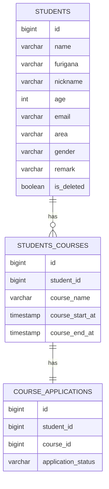

# 受講生管理システム 

Spring Bootを用いた受講生管理システムです。 

受講生情報の登録・更新・検索機能を実装しています。 
RaiseTech Javaコースの課題として開発しました。

## 作成背景

受講生・受講コース・申込状況を管理する業務システムを想定して開発しました。

本システムの開発を通じて、Spring Bootを用いたREST API開発、MyBatisによるデータベース操作、およびJUnitを用いたテストコード作成を学ぶことを目的としています。

また、単純なCRUD機能の実装だけでなく、バリデーションや例外処理、受講生・受講コース・申込状況の管理機能を実装し、実際の業務システム開発を意識して取り組みました。

## 機能一覧

### 受講生管理

* 受講生一覧検索
* 受講生検索
* 受講生条件検索
* 受講生登録
* 受講生更新

### 受講コース管理

* 受講コース追加
* 受講コース更新

## 使用技術

| 分類 | 技術 | 用途 |
|------|------|------|
| Language | Java 21 | バックエンド開発 |
| Framework | Spring Boot | REST API開発 |
| ORM | MyBatis | DBアクセス |
| Database | MySQL | データ管理 |
| Test | JUnit5 | 単体テスト |
| Test | Mockito | モックを用いたテスト |
| Test | H2 Database | テスト用DB |
| Library | Lombok | ボイラープレート削減 |
| API Docs | Swagger / OpenAPI | API仕様の可視化 |
| Cloud | AWS EC2 | アプリケーション実行環境 |
| Database | AWS RDS(MySQL) | データベース環境 |
| CI/CD | GitHub Actions | 自動ビルド・自動デプロイ |
| Build Tool | Gradle | ビルド管理 |
| VCS | Git / GitHub | ソースコード管理 |

## ER図

## AWS・インフラ構成

本アプリケーションはAWS上にデプロイし、CI/CD環境を構築しています。

### 構成

- AWS EC2 に Spring Boot アプリケーションをデプロイ
- AWS RDS(MySQL) を利用してデータを管理
- EC2 と RDS 間はセキュリティグループで通信を制御
- systemd を利用してアプリケーションをサービス化

### CI/CD

- GitHub Actions を利用した自動デプロイを構築
- GradleでビルドしたjarファイルをEC2へ転送
- デプロイ後のサービス再起動を自動化

### セキュリティ対策

- GitHub Secrets による機密情報管理
- known_hosts を利用したSSHホスト検証
- SSH関連ファイルの権限管理
- Actionバージョン固定による安定運用

### 運用面での工夫

- systemctl is-active によるサービス稼働確認
- 起動失敗時は journalctl のログを出力
- GitHub Actions 上でデプロイ結果を確認可能

## API一覧 

| Method | Path | 内容 | 
|----------|----------|----------| 
| GET | /studentList | 受講生一覧検索 | 
| GET | /student/{id} | 受講生検索 | 
| POST | /studentListByCondition | 受講生条件検索 | 
| POST | /registerStudent | 受講生登録 | 
| POST | /addCourse/{id} | 受講コース追加 | 
| PUT | /updateStudent | 受講生更新 | 
| PUT | /updateCourseDetail | 受講コース更新 |

## API仕様（Swagger）

API仕様はSwagger UIで確認できます。

http://localhost:8080/swagger-ui/index.html

## 工夫した点

### 条件検索機能の実装

受講生・コース・申込状況を対象とした条件検索機能を実装しました。

当初は複数回のデータ取得を行い、アプリケーション側で組み立てる方法を想定していましたが、
効率性や実装の複雑さを考慮し、SQLのJOINを用いて一度で取得する設計に変更しました。

また、検索結果に合わせてDTOを新たに設計し、
必要なデータのみを扱う形に整理しました。

その後、ソートや検索条件の切り替えにも対応できるよう拡張しました。

---

### 申込状況機能の実装

受講生とコースの関係に対して申込状況を管理するため、
申込状況テーブルを新規に設計・追加しました。

リポジトリ層では全件検索・条件検索・登録・更新機能を実装し、
検索用途に応じた取得ができるようにしました。

また、既存の受講生詳細との整合性を考慮しながら、
DTOやConverterを用いてデータ構造を整理しました。

さらに、申込状況の状態管理を明確にするためにEnum化を行い、
あわせてコース追加APIの実装など設計の改善も行いました。

---

### 例外処理の実装

業務例外とシステム例外を分けることを意識しながら実装しました。
エラーの種類を整理することで、原因の切り分けがしやすい構造にしました。

---

### テストの実装

各レイヤーごとに単体テストを実装しました。
JUnitを用いて各層の動作確認を行い、
Mockitoを使用して依存関係をモック化することで、
テストの独立性を確保しました。

## 苦労した点

### 条件検索機能の設計

複数テーブルにまたがる条件検索を実装する際、
当初は各テーブルごとに必要なデータを個別に取得し、
アプリケーション側で結合する方法を想定していました。

しかしこの方法ではDBアクセスが複数回発生し、
実装も複雑になると感じたため設計を見直しました。

その後、JOINを用いてSQL側で結合する方法に変更しましたが、
複数テーブルの結合方法や結果の扱い方の理解に苦労しました。

さらに既存の実装と合わせるために、
DTOの設計を見直し、フラットな検索結果を扱えるよう調整しました。

---

### 申込状況機能の設計・実装

受講生とコースの関係に対して申込状況を管理するため、
申込状況テーブルを新規に追加しました。

当初はリポジトリ単位での実装を進めていましたが、
既存の受講生・コース管理機能との整合性を取る過程で、
データ構造と処理フローの見直しが必要になりました。

特に、受講生詳細情報の構造と申込状況の追加により、
既存のデータ構造との間に不整合が発生し、
CourseDetailの設計変更やDTOの再設計を行う必要がありました。

また、サービス・コントローラ層のテストにおいても、
依存関係を整理しながらテスト対象の単位を決める点に苦労しました。

---

### AWS環境構築とデプロイ

AWS環境へのデプロイでは、
EC2・RDS・GitHub Actionsを連携させる必要があり、
各サービスの役割や接続設定の理解に苦労しました。

また、レビューを通して機密情報の管理や
SSHホスト認証の重要性を学び、
GitHub Secretsやknown_hostsを利用した
安全なデプロイ方法へ改善しました。

さらに、サービス起動失敗時の原因特定が難しく、
systemdやjournalctlを利用したログ確認の仕組みを整備しました。

## 今後の改善点

### API設計・実装の改善
現状は機能ごとにAPIを追加しているため、
パス設計や命名に一貫性がない部分があります。

RESTの設計原則を意識しながら、
より直感的で統一感のあるAPI設計に改善したいと考えています。

また、既存コードの構造についてもリファクタリングを行い、
可読性や保守性を向上させたいと考えています。

---

### テストの拡充（結合テスト）
単体テストは実装していますが、
複数コンポーネントを組み合わせた結合テストは未実装です。

システム全体としての動作保証のため、
結合テストの設計・実装に取り組みたいと考えています。

---

### データ構造の改善

一部のテーブル設計については改善の余地があると考えています。

具体的には、申込状況テーブルへの作成日時・更新日時の追加や、
受講生テーブルにおける年齢管理を生年月日ベースへ変更するなど、
より一貫性のあるデータ設計に改善したいと考えています。
