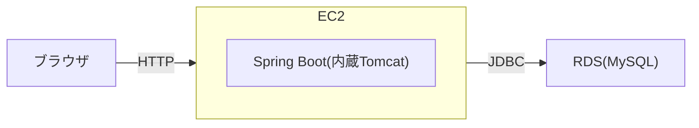

# インフラ構成書(AWS)

## 改訂履歴

| 日付 | 内容 |
|------|------|
| 2026-08-31 | 初版作成(READMEからの分離) |

---

## 目次

- [1. 概要](#1-概要)
- [2. アーキテクチャ](#2-アーキテクチャ)
- [3. AWSリソース一覧](#3-awsリソース一覧)
- [4. デプロイの仕組み](#4-デプロイの仕組み)
- [5. 運用手順](#5-運用手順)
- [6. 秘密情報の取り扱い](#6-秘密情報の取り扱い)
- [7. 今後の課題](#7-今後の課題)
- [8. トラブルシューティング記録](#8-トラブルシューティング記録)

---

## 1. 概要

AWS EC2上にSpring Bootアプリケーションをデプロイし、AWS RDS(MySQL)でデータを管理する構成。個人の学習用途のため、EC2・RDSは現状手動で作成・起動・停止している(常時稼働ではない)。

## 2. アーキテクチャ

EC2とRDSの間はセキュリティグループで通信を制御している。

## 3. AWSリソース一覧

| リソース | 設定 | 備考 |
|----------|------|------|
| EC2 | (要確認: インスタンスタイプ) | Spring Bootアプリケーションをsystemdでサービス化して実行 |
| RDS | MySQL, (要確認: インスタンスクラス) | アプリからのみ接続を許可 |
| セキュリティグループ | EC2用・RDS用 | EC2・RDS間の通信のみ許可する構成を想定 |

現時点ではAWSコンソールから手動で作成しており、Terraform等によるコード化はしていない([今後の課題](#7-今後の課題)を参照)。

## 4. デプロイの仕組み

これまでは[JavaTest.yml](../.github/workflows/JavaTest.yml)により、`main`ブランチへのpushおよびPR作成・更新のたびに以下が自動実行される構成だった。

1. `./gradlew test`でテスト実行
2. `./gradlew bootJar`でビルド
3. SCPでEC2にjarファイルを転送
4. SSHでEC2に接続し、systemdサービス(`StudentManagement`)を再起動

ただし、PR作成・更新時にも本番へのデプロイが実行されてしまう問題があったため、現在はワークフローを無効化している(Issue #13、[この会話の記録を参照](#8-トラブルシューティング記録))。ファイルの内容自体は学習の記録として変更せずに残している。

今後、TerraformでEC2/RDSをコード化する際に、デプロイフローも合わせて設計し直す予定([今後の課題](#7-今後の課題))。

## 5. 運用手順

EC2/RDSの起動・停止は現状手動(要確認: 具体的な手順があれば追記する)。

## 6. 秘密情報の取り扱い

AWSの接続情報(EC2ホスト、SSH秘密鍵)はGitHub Secretsで管理し、リポジトリには含めていない。RDSの接続情報は`application.properties`で環境変数参照する構成(要確認: 実際の環境変数名・設定方法)。

## 7. 今後の課題

未着手のまま残っている項目を記録する(着手・解決したら取り消し線または削除する)。

- [ ] Terraformでのインフラコード化(EC2/RDS/SG/キーペアの管理)
- [ ] CI/CDの再実装(テスト必須化を含む)
- [ ] 古い`feature/*`ブランチの整理

## 8. トラブルシューティング記録

実際にハマった事象・原因・対処を記録する。

| 事象 | 原因 | 対処 |
|------|------|------|
| PRを作成・更新しただけで本番EC2へのデプロイが実行されていた | JavaTest.ymlのトリガーが`push`と`pull_request`の両方になっており、マージ前のコードでもデプロイジョブが走る構成だった | ワークフローを無効化(`gh workflow disable`)。ファイルの内容は変更せず学習の記録として残す。あわせてmainブランチにPR経由でのマージを必須化する保護ルールを追加した(Issue #13) |
