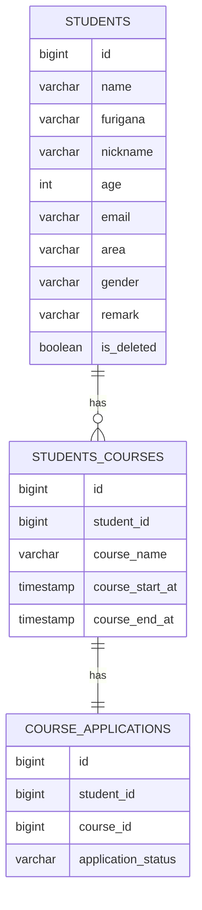

# 受講生管理システム 要件定義書

## 改訂履歴

[改訂履歴はこちら](requirements-changelog.md)

---

## 目次

- [1. 概要・背景](#1-概要背景)
- [2. 想定利用者](#2-想定利用者)
- [3. 機能要件](#3-機能要件)
- [4. データ項目・ER図](#4-データ項目er図)
- [5. 画面要件](#5-画面要件)
- [6. 今後の課題](#6-今後の課題)

---

## 1. 概要・背景

RaiseTech Javaコースの課題として開発した、受講生・受講コース・申込状況を管理する業務システム。単純なCRUD機能の実装にとどまらず、バリデーション・例外処理・状態遷移を伴う申込状況管理を実装し、実際の業務システム開発を意識して設計・実装した。

本システムの開発を通じて、以下を学ぶことを目的としている。

- Spring Bootを用いたREST API開発
- MyBatisによるデータベース操作(特に複数テーブルを横断する検索のSQL設計)
- JUnitを用いたテストコード作成(Mockitoによる依存のモック化を含む)

## 2. 想定利用者

学習課題としての個人開発のため、単一の管理者ユーザーが受講生情報を一元管理する想定。認証・認可の機能は現時点で実装していない(誰でもAPIを呼び出せる状態)。

## 3. 機能要件

### 受講生管理

- 受講生一覧検索(全件)
- 受講生検索(ID指定)
- 受講生条件検索(受講生・受講コース・申込状況を横断した条件検索、AND/OR切り替え、ソート対応)
- 受講生登録(受講コース・申込状況の初期登録を含む)
- 受講生更新(論理削除によるキャンセルフラグ更新を含む)

### 受講コース管理

- 受講コース追加(既存の受講生に対して新しいコースを追加登録)
- 受講コース更新

### 申込状況管理

受講コースごとに、以下の状態を遷移させながら管理する(`ApplicationStatus` enum)。

```
仮申込(TEMP) → 本申込(FORMAL) → 受講中(IN_PROGRESS) → 受講終了(COMPLETED)
                    ↓                    ↓
                キャンセル(CANCEL)   キャンセル(CANCEL)
```

定義されていない遷移(例: 受講終了から仮申込へ戻す等)はリクエストしても`InvalidStatusTransitionException`により拒否される。

## 4. データ項目・ER図



| テーブル | 項目 | 内容 |
|----------|------|------|
| STUDENTS | is_deleted | 論理削除フラグ。更新APIでtrueにすることでキャンセル扱いとする |
| STUDENTS_COURSES | course_start_at / course_end_at | コース登録時、開始日を現在時刻、終了日を1年後に自動設定する |
| COURSE_APPLICATIONS | application_status | 上記の状態遷移ルールに従う |

## 5. 画面要件

### 受講生一覧画面

`GET /students`(全件検索API)の結果を表として表示する。表示項目は以下の7項目(`StudentDetail.student`の値をそのまま使用し、`courseDetailList`は本画面では使用しない)。

| 項目 | 対応するデータ項目 |
|------|--------------------|
| 名前 | name |
| ふりがな | furigana |
| ニックネーム | nickname |
| 年齢 | age |
| メール | email |
| 地域 | area |
| 性別 | gender |

論理削除(`is_deleted = true`)された受講生は、一覧に表示しない(フロントエンド側でフィルタする。APIレスポンス自体には含まれる)。

登録フォーム・コース詳細更新画面は未着手。着手時にこの節へ追記する。

## 6. 今後の課題

未着手のまま残っている項目を記録する(着手・解決したら取り消し線または削除する)。

- [ ] 年齢管理を生年月日ベースへ変更する
- [ ] 申込状況テーブルへの作成日時・更新日時の追加
- [ ] API設計の一貫性改善(パス設計・命名の統一)
